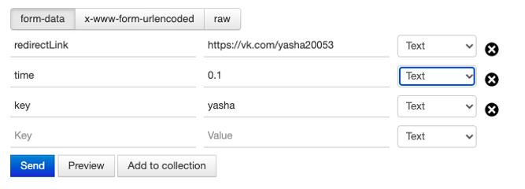
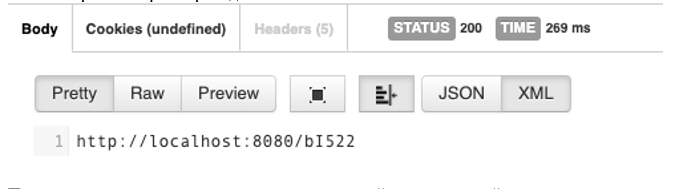
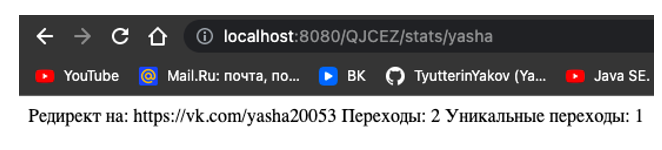

#ShortLink #Java
Для того, чтобы создать короткую ссылку необходимо отправить POST запрос вида

на адрес вашего хоста, например http://localhost:8080/,
где:
•	redirectLink – это ссылка, которую необходимо сократить;
•	time – время жизни ссылки в часах (в конечно итоге переводится в минуты, соответственно значимыми будут только десятые доли);
•	key - секретный ключ, который будет служить для доступа к статистике по ссылке и для ее удаления.
После отправки запроса приходит ответ с ссылкой

Программа проверяет наличие уже существующей и не истекшей ссылки у данного пользователя и создает или отдает уже готовую ссылку, предотвращая дублирование записей.
Программа производит подсчет общего и уникального числа переходов.
Информацию по переходам можно посмотреть при обращении по ссылке 

“Домен/сгенерированный хэш/stats/секретный ключ(key)”. Доступ к этой информации может получить только тот, кто создал ссылку и кто знает секретный ключ.  
